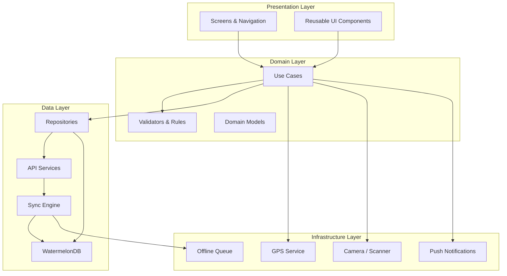
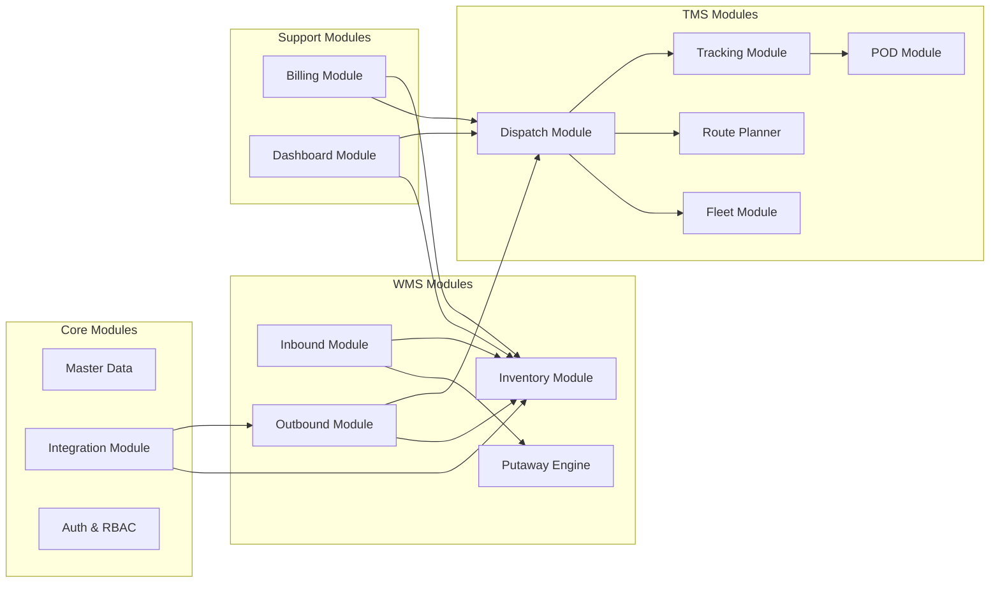
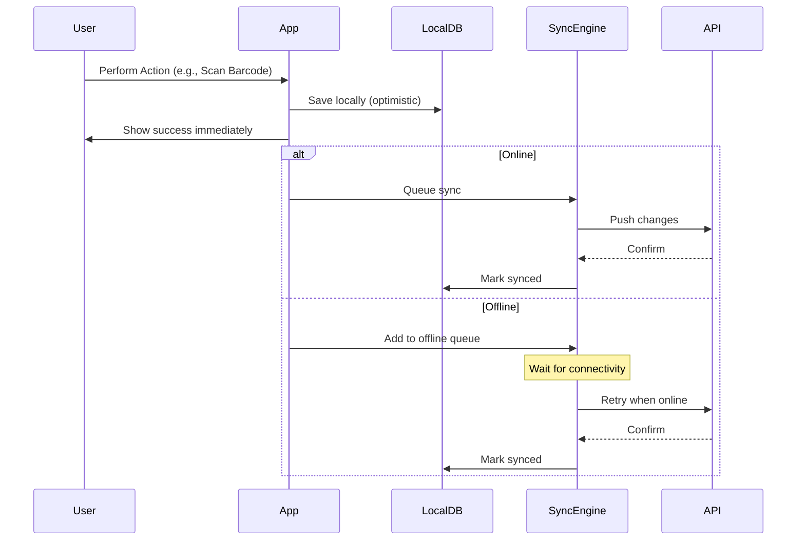

# เอกสารออกแบบทางเทคนิค (Technical Design Document)

## ภาพรวม (Overview)

ระบบจัดการคลังสินค้าและโลจิสติกส์ (WMS + TMS) เป็นแอปพลิเคชัน React Native ที่ออกแบบบนสถาปัตยกรรม Modular Layered Architecture เพื่อรองรับการทำงานครบวงจรทั้งด้านคลังสินค้าและการขนส่ง ระบบแบ่งออกเป็น 4 ชั้นหลัก:

1. **Presentation Layer** — UI Components, Screens, Navigation
2. **Domain Layer** — Business Logic, Use Cases, Validation Rules
3. **Data Layer** — Repositories, API Services, Local Storage
4. **Infrastructure Layer** — Offline Sync, Push Notifications, Device APIs (Camera, GPS, Barcode Scanner)

### เทคโนโลยีหลัก
- **Frontend**: React Native 0.87 + TypeScript
- **State Management**: Zustand (lightweight, minimal boilerplate)
- **Navigation**: React Navigation v6
- **Local Storage**: WatermelonDB (offline-first, sync-capable)
- **API Client**: Axios with retry/queue mechanism
- **Maps**: React Native Maps + Google Maps API
- **Barcode**: react-native-camera + ML Kit Barcode Scanning
- **Charts**: react-native-chart-kit
- **Testing**: Jest + fast-check (property-based testing)

### ขอบเขตของระบบ
- แอปทำหน้าที่เป็น Client ที่เชื่อมต่อกับ Backend API (ไม่ได้ออกแบบ Backend ในเอกสารนี้)
- รองรับ Offline-first สำหรับงานสำคัญ (barcode scanning, data entry)
- ข้อมูลจะ sync เมื่อกลับมาออนไลน์ผ่าน Conflict Resolution Strategy

---

## สถาปัตยกรรม (Architecture)

### High-Level Architecture Diagram



### Module Architecture



### Offline Sync Strategy



---

## ส่วนประกอบและอินเทอร์เฟซ (Components and Interfaces)

### โครงสร้างโฟลเดอร์

```
src/
├── app/                        # App entry, navigation setup
├── modules/
│   ├── inbound/               # WMS - Inbound
│   │   ├── screens/
│   │   ├── components/
│   │   ├── useCases/
│   │   ├── repositories/
│   │   └── types.ts
│   ├── putaway/               # WMS - Put-away
│   ├── inventory/             # WMS - Inventory
│   ├── outbound/              # WMS - Outbound
│   ├── fleet/                 # TMS - Fleet
│   ├── route/                 # TMS - Route Planning
│   ├── dispatch/              # TMS - Dispatching
│   ├── tracking/              # TMS - Tracking & POD
│   ├── billing/               # Billing
│   ├── dashboard/             # Dashboard & KPI
│   ├── masterData/            # Master Data
│   └── integration/           # API Integration
├── shared/
│   ├── components/            # Shared UI components
│   ├── hooks/                 # Shared hooks
│   ├── services/              # API client, sync engine
│   ├── utils/                 # Utility functions
│   ├── types/                 # Global types
│   └── constants/
├── infrastructure/
│   ├── database/              # WatermelonDB setup
│   ├── sync/                  # Sync engine
│   ├── offline/               # Offline queue
│   ├── notifications/         # Push notification handler
│   └── device/                # GPS, Camera, Scanner
└── store/                     # Zustand stores
```

### Key Interfaces

```typescript
// === Inbound Module ===
interface InboundUseCases {
  scanBarcode(code: string): Promise<ScannedItemResult>;
  compareWithPO(items: ScannedItem[], poId: string): POComparisonResult;
  confirmReceiving(grn: GRNDraft): Promise<GRN>;
  recordDamage(item: ScannedItem, damage: DamageReport): Promise<void>;
  generateLabel(grn: GRN): Promise<LabelData>;
}

// === Putaway Engine ===
interface PutawayUseCases {
  suggestBin(item: ReceivedItem): Promise<BinSuggestion[]>;
  confirmPutaway(itemId: string, binId: string): Promise<void>;
  getSuggestedAlternatives(binId: string, item: ReceivedItem): Promise<BinSuggestion[]>;
}

interface PutawayRules {
  isFastMoving(sku: SKU): boolean;
  requiresTemperatureControl(sku: SKU): boolean;
  getBinPriority(bin: Bin, sku: SKU): number;
}

// === Inventory Module ===
interface InventoryUseCases {
  getStockLevel(skuId: string): Promise<StockLevel>;
  getAllStockLevels(filters: StockFilter): Promise<PaginatedResult<StockLevel>>;
  transferStock(transfer: StockTransfer): Promise<void>;
  createCycleCount(params: CycleCountParams): Promise<CycleCount>;
  recordCountResult(countId: string, results: CountResult[]): Promise<CountDiscrepancy[]>;
  approveAdjustment(countId: string, approvedBy: string): Promise<void>;
}

interface StockAlertRules {
  checkMinThreshold(stock: StockLevel): AlertResult | null;
  checkMaxThreshold(stock: StockLevel): AlertResult | null;
}

// === Outbound Module ===
interface OutboundUseCases {
  createPickList(orderId: string): Promise<PickList>;
  optimizePickRoute(pickList: PickList): PickList;
  batchPick(orderIds: string[]): Promise<BatchPickList>;
  zonePick(pickList: PickList, zones: Zone[]): ZonePickAssignment[];
  confirmPick(pickItemId: string, scannedSKU: string, quantity: number): PickConfirmResult;
  getWorkerQueue(workerId: string): Promise<WorkerQueue>;
}

// === Fleet Module ===
interface FleetUseCases {
  registerVehicle(vehicle: VehicleDraft): Promise<Vehicle>;
  registerDriver(driver: DriverDraft): Promise<Driver>;
  recordMaintenance(vehicleId: string, record: MaintenanceRecord): Promise<void>;
  getExpiringDocuments(daysAhead: number): Promise<ExpiringDocument[]>;
  createMaintenanceOrder(vehicleId: string): Promise<MaintenanceOrder>;
}

// === Route Planner ===
interface RoutePlannerUseCases {
  calculateOptimalRoute(deliveryPoints: DeliveryPoint[]): Promise<OptimizedRoute>;
  checkLoadCapacity(items: ShipmentItem[], vehicleId: string): LoadCheckResult;
  recalculateRoute(currentRoute: OptimizedRoute, changes: RouteChange[]): Promise<OptimizedRoute>;
  getEstimatedDeliveryTimes(route: OptimizedRoute): DeliveryTimeEstimate[];
}

// === Dispatch Module ===
interface DispatchUseCases {
  createTransportOrder(order: TransportOrderDraft): Promise<TransportOrder>;
  matchVehicleAndDriver(orderId: string): Promise<DispatchMatch[]>;
  confirmDispatch(orderId: string, matchId: string): Promise<DeliveryBill>;
  calculateTripCost(tripId: string): Promise<TripCost>;
  driverAcceptJob(orderId: string, driverId: string): Promise<void>;
}

// === Tracking & POD Module ===
interface TrackingUseCases {
  startTracking(orderId: string): Promise<void>;
  updateLocation(orderId: string, location: GPSCoordinate): Promise<void>;
  getDeliveryStatus(orderId: string): Promise<DeliveryStatus>;
  recordPOD(pod: ProofOfDelivery): Promise<void>;
  recordRejection(rejection: DeliveryRejection): Promise<void>;
}

// === Billing Module ===
interface BillingUseCases {
  calculateWarehouseRent(params: RentParams): Money;
  calculatePickingFee(itemCount: number): Money;
  calculateTransportCost(trip: TripData): TripCost;
  calculate3PLBilling(usage: ThreePLUsage, contract: Contract): Invoice;
  calculateFuelCost(distance: number, vehicle: Vehicle): Money;
  generateBillingSummary(period: DateRange): BillingSummary;
}

// === Dashboard Module ===
interface DashboardUseCases {
  getInventoryAccuracy(): Promise<Percentage>;
  getAveragePackingTime(filters: DashboardFilter): Promise<Duration>;
  getOnTimeDeliveryRate(filters: DashboardFilter): Promise<Percentage>;
  getKPIAlerts(thresholds: KPIThresholds): Promise<KPIAlert[]>;
}

// === Master Data Module ===
interface MasterDataUseCases {
  createSKU(sku: SKUDraft): Promise<SKU>;
  updateSKU(id: string, updates: Partial<SKU>): Promise<SKU>;
  searchMasterData(query: string, type: MasterDataType): Promise<MasterDataItem[]>;
  getAuditHistory(entityId: string): Promise<AuditEntry[]>;
}

// === Integration Module ===
interface IntegrationUseCases {
  syncPOFromERP(erpType: 'SAP' | 'Oracle'): Promise<SyncResult>;
  pullECommerceOrders(platform: ECommercePlatform): Promise<Order[]>;
  pushStatusUpdate(orderId: string, status: OrderStatus): Promise<void>;
  retryFailedSync(): Promise<RetryResult>;
  mapData(source: ExternalData, schema: DataSchema): MappedData;
}
```

### Shared Services

```typescript
// === Sync Engine ===
interface SyncEngine {
  enqueue(action: SyncAction): void;
  processQueue(): Promise<SyncResult>;
  getQueueStatus(): QueueStatus;
  resolveConflict(conflict: SyncConflict, strategy: ConflictStrategy): Promise<void>;
}

// === Offline Queue ===
interface OfflineQueue {
  add(item: QueueItem): void;
  peek(): QueueItem | null;
  process(): Promise<ProcessResult>;
  getCount(): number;
}

// === Auth & RBAC ===
interface AuthService {
  login(credentials: Credentials): Promise<AuthToken>;
  checkPermission(userId: string, action: string, resource: string): boolean;
  getSessionTimeout(): number;
  lockScreen(): void;
  getAuditLog(filters: AuditFilter): Promise<AuditEntry[]>;
}

type Role = 'admin' | 'warehouse_manager' | 'picker' | 'driver' | 'finance' | 'viewer';
```


---

## แบบจำลองข้อมูล (Data Models)

### Core Entities

```typescript
// === Inbound ===
interface GRN {
  id: string;
  poId: string;
  receivedAt: Date;
  receivedBy: string;
  items: GRNItem[];
  status: 'draft' | 'confirmed' | 'discrepancy';
  totalQuantityExpected: number;
  totalQuantityReceived: number;
  discrepancyNotes?: string;
  syncStatus: SyncStatus;
}

interface GRNItem {
  id: string;
  grnId: string;
  skuId: string;
  expectedQuantity: number;
  receivedQuantity: number;
  isDamaged: boolean;
  damageReport?: DamageReport;
}

interface DamageReport {
  id: string;
  grnItemId: string;
  photos: string[]; // URI paths
  reason: string;
  quantity: number;
  reportedAt: Date;
}

// === Putaway ===
interface Bin {
  id: string;
  code: string;
  zone: string;
  aisle: string;
  rack: string;
  level: string;
  capacity: number;
  currentOccupancy: number;
  temperatureControlled: boolean;
  temperatureRange?: { min: number; max: number };
  distanceFromDoor: number; // meters
}

interface BinSuggestion {
  bin: Bin;
  score: number;       // priority score (higher = better)
  reason: string;
  isAlternative: boolean;
}

// === Inventory ===
interface StockLevel {
  skuId: string;
  binId: string;
  quantity: number;
  reservedQuantity: number;
  availableQuantity: number; // quantity - reservedQuantity
  minThreshold: number;
  maxThreshold: number;
  lastUpdated: Date;
}

interface StockTransfer {
  id: string;
  skuId: string;
  fromBinId: string;
  toBinId: string;
  quantity: number;
  transferredBy: string;
  transferredAt: Date;
  reason?: string;
}

interface CycleCount {
  id: string;
  scheduledDate: Date;
  status: 'pending' | 'in_progress' | 'completed' | 'approved';
  groupBy: 'sku_category' | 'bin_zone';
  items: CycleCountItem[];
  createdBy: string;
}

interface CycleCountItem {
  id: string;
  cycleCountId: string;
  skuId: string;
  binId: string;
  systemQuantity: number;
  countedQuantity?: number;
  discrepancy?: number;
  countedBy?: string;
  countedAt?: Date;
}

// === Outbound ===
interface PickList {
  id: string;
  orderId: string;
  items: PickItem[];
  strategy: 'single' | 'batch' | 'zone';
  assignedTo?: string;
  status: 'pending' | 'in_progress' | 'completed';
  priority: number;
  optimizedRoute?: string[]; // ordered bin IDs
}

interface PickItem {
  id: string;
  pickListId: string;
  skuId: string;
  binId: string;
  quantity: number;
  pickedQuantity: number;
  status: 'pending' | 'picked' | 'error';
  sequence: number; // order in optimized route
}

// === Fleet ===
interface Vehicle {
  id: string;
  licensePlate: string;
  type: 'truck' | 'van' | 'motorcycle';
  maxWeight: number; // kg
  maxVolume?: number; // cubic meters
  status: 'available' | 'in_use' | 'maintenance' | 'retired';
  insuranceExpiry: Date;
  registrationExpiry: Date;
  fuelConsumption: number; // km per liter
  currentMileage: number;
  nextMaintenanceMileage: number;
}

interface Driver {
  id: string;
  name: string;
  licenseNumber: string;
  licenseExpiry: Date;
  status: 'available' | 'on_trip' | 'off_duty';
  phone: string;
  assignedVehicleId?: string;
}

interface MaintenanceRecord {
  id: string;
  vehicleId: string;
  type: 'scheduled' | 'unscheduled';
  description: string;
  cost: number;
  date: Date;
  mileageAtService: number;
  nextServiceMileage?: number;
  nextServiceDate?: Date;
}

// === Route & Dispatch ===
interface DeliveryPoint {
  id: string;
  orderId: string;
  latitude: number;
  longitude: number;
  address: string;
  contactName: string;
  contactPhone: string;
  timeWindow?: { start: Date; end: Date };
  items: ShipmentItem[];
}

interface OptimizedRoute {
  id: string;
  vehicleId: string;
  driverId: string;
  points: OrderedDeliveryPoint[];
  totalDistance: number; // km
  totalEstimatedTime: number; // minutes
  totalWeight: number; // kg
  polyline?: string; // encoded polyline from Google Maps
}

interface OrderedDeliveryPoint extends DeliveryPoint {
  sequence: number;
  estimatedArrival: Date;
  distanceFromPrevious: number;
}

interface TransportOrder {
  id: string;
  status: 'created' | 'dispatched' | 'in_transit' | 'delivered' | 'failed';
  deliveryPoints: DeliveryPoint[];
  vehicleId?: string;
  driverId?: string;
  route?: OptimizedRoute;
  deliveryBill?: DeliveryBill;
  createdAt: Date;
  dispatchedAt?: Date;
}

interface DeliveryBill {
  id: string;
  transportOrderId: string;
  items: ShipmentItem[];
  deliveryPoints: DeliveryPoint[];
  recipientInfo: RecipientInfo[];
  costs: TripCost;
  createdAt: Date;
}

interface TripCost {
  fuelCost: number;
  tollCost: number;
  driverAllowance: number;
  otherCosts: number;
  totalCost: number;
  currency: string;
}

// === Tracking & POD ===
interface GPSCoordinate {
  latitude: number;
  longitude: number;
  timestamp: Date;
  accuracy?: number;
}

interface DeliveryStatus {
  orderId: string;
  status: 'pending' | 'picked_up' | 'in_transit' | 'arriving' | 'delivered' | 'failed';
  currentLocation?: GPSCoordinate;
  estimatedArrival?: Date;
  lastUpdated: Date;
}

interface ProofOfDelivery {
  id: string;
  transportOrderId: string;
  deliveryPointId: string;
  photos: string[];
  signature: string; // base64 encoded signature image
  gpsCoordinate: GPSCoordinate;
  deliveredAt: Date;
  receiverName: string;
  notes?: string;
}

interface DeliveryRejection {
  id: string;
  transportOrderId: string;
  deliveryPointId: string;
  reason: string;
  photos: string[];
  gpsCoordinate: GPSCoordinate;
  rejectedAt: Date;
  reportedBy: string;
}

// === Billing ===
interface Invoice {
  id: string;
  type: 'warehouse_rent' | 'picking_fee' | 'transport' | '3pl';
  period: DateRange;
  lineItems: InvoiceLineItem[];
  subtotal: number;
  tax: number;
  total: number;
  status: 'draft' | 'issued' | 'paid';
  createdAt: Date;
}

interface BillingSummary {
  period: DateRange;
  warehouseRent: number;
  pickingFees: number;
  transportCosts: number;
  threePLCosts: number;
  totalCosts: number;
  breakdown: CategoryBreakdown[];
}

// === Master Data ===
interface SKU {
  id: string;
  code: string; // unique
  name: string;
  category: string;
  weight: number;
  dimensions: { length: number; width: number; height: number };
  imageUrl?: string;
  temperatureRequirement?: { min: number; max: number };
  movementRate: 'fast' | 'medium' | 'slow';
  barcode: string;
}

interface Supplier {
  id: string;
  code: string;
  name: string;
  address: string;
  contactPerson: string;
  contactPhone: string;
  contactEmail: string;
  purchaseTerms?: string;
}

interface Customer {
  id: string;
  code: string;
  name: string;
  deliveryAddress: string;
  contactPerson: string;
  contactPhone: string;
  deliveryTerms?: string;
}

interface AuditEntry {
  id: string;
  entityType: string;
  entityId: string;
  action: 'create' | 'update' | 'delete';
  changedBy: string;
  changedAt: Date;
  previousValue?: Record<string, unknown>;
  newValue?: Record<string, unknown>;
}

// === Shared Types ===
type SyncStatus = 'synced' | 'pending' | 'conflict' | 'failed';

interface DateRange {
  start: Date;
  end: Date;
}

interface PaginatedResult<T> {
  data: T[];
  total: number;
  page: number;
  pageSize: number;
  hasMore: boolean;
}

interface Money {
  amount: number;
  currency: string;
}

type ECommercePlatform = 'shopee' | 'lazada' | 'tiktok_shop';
```

### Key Algorithms

#### Put-away Bin Scoring Algorithm

```typescript
function calculateBinScore(bin: Bin, sku: SKU): number {
  let score = 100;

  // Temperature compatibility (mandatory)
  if (sku.temperatureRequirement && !bin.temperatureControlled) return -1;
  if (sku.temperatureRequirement && bin.temperatureControlled) {
    const tempOk =
      bin.temperatureRange!.min <= sku.temperatureRequirement.min &&
      bin.temperatureRange!.max >= sku.temperatureRequirement.max;
    if (!tempOk) return -1;
  }

  // Fast-moving items prefer bins near door
  if (sku.movementRate === 'fast') {
    score += Math.max(0, 50 - bin.distanceFromDoor);
  }

  // Occupancy penalty (prefer emptier bins)
  const occupancyRatio = bin.currentOccupancy / bin.capacity;
  score -= occupancyRatio * 30;

  // Capacity check
  if (bin.currentOccupancy >= bin.capacity) return -1;

  return score;
}
```

#### Pick Route Optimization (Nearest Neighbor Heuristic)

```typescript
function optimizePickRoute(items: PickItem[], bins: Map<string, Bin>): PickItem[] {
  const unvisited = [...items];
  const route: PickItem[] = [];
  let currentPosition = { aisle: '0', rack: '0', level: '0' }; // start at door

  while (unvisited.length > 0) {
    let nearestIdx = 0;
    let nearestDist = Infinity;

    for (let i = 0; i < unvisited.length; i++) {
      const bin = bins.get(unvisited[i].binId)!;
      const dist = calculateBinDistance(currentPosition, bin);
      if (dist < nearestDist) {
        nearestDist = dist;
        nearestIdx = i;
      }
    }

    const nearest = unvisited.splice(nearestIdx, 1)[0];
    route.push({ ...nearest, sequence: route.length + 1 });
    const bin = bins.get(nearest.binId)!;
    currentPosition = { aisle: bin.aisle, rack: bin.rack, level: bin.level };
  }

  return route;
}
```

#### Billing Calculation Functions

```typescript
function calculateWarehouseRent(area: number, ratePerSqm: number, days: number): Money {
  return { amount: area * ratePerSqm * days, currency: 'THB' };
}

function calculatePickingFee(itemCount: number, ratePerItem: number): Money {
  return { amount: itemCount * ratePerItem, currency: 'THB' };
}

function calculateFuelCost(distance: number, fuelConsumption: number, fuelPrice: number): Money {
  const litersUsed = distance / fuelConsumption;
  return { amount: litersUsed * fuelPrice, currency: 'THB' };
}

function calculateTransportCost(
  fuelCost: Money,
  tollCost: number,
  driverAllowance: number,
  otherCosts: number
): TripCost {
  const total = fuelCost.amount + tollCost + driverAllowance + otherCosts;
  return {
    fuelCost: fuelCost.amount,
    tollCost,
    driverAllowance,
    otherCosts,
    totalCost: total,
    currency: 'THB',
  };
}
```

#### KPI Calculation Functions

```typescript
function calculateInventoryAccuracy(
  systemStock: Map<string, number>,
  countedStock: Map<string, number>
): number {
  let matches = 0;
  let total = 0;
  for (const [skuId, sysQty] of systemStock) {
    total++;
    if (countedStock.get(skuId) === sysQty) matches++;
  }
  return total > 0 ? (matches / total) * 100 : 100;
}

function calculateOnTimeDeliveryRate(deliveries: Delivery[]): number {
  if (deliveries.length === 0) return 100;
  const onTime = deliveries.filter(
    (d) => d.actualDeliveryTime <= d.estimatedDeliveryTime
  ).length;
  return (onTime / deliveries.length) * 100;
}
```


---

## คุณสมบัติความถูกต้อง (Correctness Properties)

*คุณสมบัติ (Property) คือลักษณะหรือพฤติกรรมที่ควรเป็นจริงเสมอในทุกการทำงานที่ถูกต้องของระบบ — เป็นข้อความทางการเกี่ยวกับสิ่งที่ระบบควรทำ Properties ทำหน้าที่เป็นสะพานเชื่อมระหว่างข้อกำหนดที่มนุษย์อ่านได้กับการรับประกันความถูกต้องที่เครื่องสามารถตรวจสอบได้*

### Property 1: การค้นหาสินค้าจากบาร์โค้ดตรงกับ PO

*For any* valid barcode/QR code ที่ถูกสแกน ระบบจะต้องคืนข้อมูลสินค้าที่ตรงกับ SKU ในบาร์โค้ดนั้น และหาก SKU นั้นมีอยู่ใน PO ที่เปิดอยู่ ระบบจะต้องจับคู่กับ PO ที่ถูกต้อง

**Validates: Requirements 1.1**

### Property 2: GRN ที่สร้างต้องมีข้อมูลครบถ้วน

*For any* รายการสินค้าที่ได้รับ เมื่อยืนยันการรับสินค้า GRN ที่สร้างขึ้นจะต้องมีจำนวนสินค้าที่รับเท่ากับผลรวมของรายการทั้งหมด มีวันที่และเวลาที่ถูกต้อง และมี status เป็น 'confirmed'

**Validates: Requirements 1.2**

### Property 3: สินค้าเสียหายต้องมีรายงานแยก

*For any* สินค้าที่ถูกระบุว่าเสียหาย DamageReport ที่สร้างขึ้นจะต้องมี photos อย่างน้อย 1 รูป มี reason ที่ไม่ว่าง และมี quantity > 0

**Validates: Requirements 1.3**

### Property 4: การกรอง GRN คืนผลลัพธ์ที่ตรงเงื่อนไข

*For any* ชุดของ GRN และเงื่อนไขการกรอง (วันที่, ผู้จัดจำหน่าย, สถานะ) ผลลัพธ์ที่คืนมาจะต้องมีเฉพาะ GRN ที่ตรงกับเงื่อนไขทั้งหมดที่ระบุ

**Validates: Requirements 1.4**

### Property 5: Label round-trip

*For any* GRN ที่เสร็จสมบูรณ์ บาร์โค้ด/QR Code ที่สร้างขึ้นจะต้องสามารถถอดรหัสกลับมาได้ข้อมูลที่ตรงกับสินค้าต้นฉบับ

**Validates: Requirements 1.5**

### Property 6: การตรวจจับส่วนต่างระหว่างสินค้ารับเข้ากับ PO

*For any* PO และจำนวนสินค้าที่รับเข้า หากจำนวนที่รับ ≠ จำนวนใน PO ระบบจะต้องตรวจพบและบันทึก discrepancy ที่มีค่าเท่ากับ |received - expected| สำหรับทุก SKU ที่มีส่วนต่าง

**Validates: Requirements 1.6**

### Property 7: Putaway แนะนำ Bin ที่เหมาะกับประเภทสินค้า

*For any* สินค้าที่รับเข้าเสร็จสมบูรณ์ Putaway Engine จะต้องแนะนำ Bin อย่างน้อย 1 ตำแหน่ง และ Bin ที่แนะนำจะต้องมีความจุเพียงพอ (currentOccupancy < capacity)

**Validates: Requirements 2.1**

### Property 8: สินค้า Fast-moving ได้ตำแหน่งใกล้ประตู

*For any* สินค้า fast-moving และ สินค้า slow-moving ที่มี Bin ที่เป็นไปได้เหมือนกัน ค่า score ของ Bin ที่ใกล้ประตูสำหรับสินค้า fast-moving จะต้องสูงกว่าสำหรับสินค้า slow-moving

**Validates: Requirements 2.2**

### Property 9: สินค้าควบคุมอุณหภูมิต้องอยู่ในโซนที่เหมาะสม

*For any* สินค้าที่มี temperatureRequirement ทุก BinSuggestion ที่คืนมาจะต้องเป็น Bin ที่ temperatureControlled = true และ temperatureRange ครอบคลุม temperatureRequirement ของสินค้า

**Validates: Requirements 2.3**

### Property 10: Putaway ยืนยันแล้วอัปเดตตำแหน่ง

*For any* การยืนยัน putaway (itemId, binId) เมื่อ query ตำแหน่งของ item หลังจากนั้น จะต้องได้ binId ที่ตรงกับที่ยืนยัน

**Validates: Requirements 2.4**

### Property 11: สต็อกสะท้อนการดำเนินงานทั้งหมด

*For any* ลำดับของการรับเข้า (receive) และการหยิบออก (pick) สำหรับ SKU ใดๆ จำนวนสต็อกจะต้องเท่ากับ ผลรวมของ receives - ผลรวมของ picks

**Validates: Requirements 3.1**

### Property 12: การแจ้งเตือน Threshold ของสต็อก

*For any* SKU ที่มีค่า stock, minThreshold, maxThreshold ระบบจะต้องสร้าง alert ก็ต่อเมื่อ stock < minThreshold หรือ stock > maxThreshold และจะต้องไม่สร้าง alert เมื่อ minThreshold ≤ stock ≤ maxThreshold

**Validates: Requirements 3.2, 3.3**

### Property 13: การย้ายสต็อกบันทึกครบทุกฟิลด์

*For any* การย้ายสต็อก StockTransfer record ที่สร้างขึ้นจะต้องมี fromBinId, toBinId, quantity > 0 และ transferredAt ที่ถูกต้อง

**Validates: Requirements 3.4**

### Property 14: Cycle Count สร้างรายการตรงกับกลุ่มที่กำหนด

*For any* CycleCountParams ที่ระบุ groupBy เป็น 'sku_category' หรือ 'bin_zone' ทุก item ใน CycleCount ที่สร้างขึ้นจะต้องอยู่ในกลุ่ม/โซนที่ระบุ

**Validates: Requirements 3.5**

### Property 15: ส่วนต่างจากการนับสต็อก

*For any* CycleCountItem ที่ countedQuantity ≠ systemQuantity ระบบจะต้องสร้าง discrepancy record ที่มีค่าเท่ากับ countedQuantity - systemQuantity

**Validates: Requirements 3.6**

### Property 16: Pick List ถูกสร้างจากคำสั่งซื้อ

*For any* คำสั่งซื้อ (Order) ที่มีรายการสินค้า Pick List ที่สร้างจะต้องมี items ครบทุก SKU ที่อยู่ในคำสั่งซื้อ และจำนวนรวมเท่ากัน

**Validates: Requirements 4.1**

### Property 17: Pick Route ไม่ยาวกว่า Naive Ordering

*For any* PickList ที่มี items ≥ 2 รายการ ระยะทางรวมของ optimized route จะต้อง ≤ ระยะทางรวมของ naive sequential ordering

**Validates: Requirements 4.2**

### Property 18: Batch Picking รวม SKU ที่ซ้ำกัน

*For any* ชุดของ orders ที่มี SKU ซ้ำกัน batch pick list จะต้องมี quantity ของแต่ละ SKU = ผลรวมของ quantity จากทุก order ที่มี SKU นั้น

**Validates: Requirements 4.3**

### Property 19: Zone Picking แบ่งตาม Zone ถูกต้อง

*For any* PickList และชุดของ Zones ทุก PickItem จะต้องถูกมอบหมายไปยัง zone ที่ตรงกับ zone ของ Bin ที่ item อยู่ และทุก item ต้องถูกมอบหมายเพียง zone เดียว

**Validates: Requirements 4.4**

### Property 20: การยืนยันหยิบสินค้าตรวจสอบ SKU

*For any* การสแกนยืนยัน (scannedSKU, quantity) เทียบกับ PickItem ที่คาดหวัง ผลลัพธ์จะต้องเป็น success ก็ต่อเมื่อ scannedSKU = expectedSKU AND quantity = expectedQuantity

**Validates: Requirements 4.5**

### Property 21: คิวงานเรียงตามลำดับความสำคัญ

*For any* ชุดของ tasks ที่มอบหมายให้พนักงาน WorkerQueue ที่คืนมาจะต้องเรียงลำดับ priority จากมากไปน้อย

**Validates: Requirements 4.6**

### Property 22: Fleet Data Round-trip

*For any* ข้อมูลยานพาหนะ พนักงานขับรถ หรือ MaintenanceRecord ที่ถูกต้อง การสร้างแล้วอ่านกลับมาจะต้องได้ข้อมูลที่เทียบเท่ากับข้อมูลต้นฉบับ

**Validates: Requirements 5.1, 5.2, 5.3**

### Property 23: การแจ้งเตือนเอกสารหมดอายุ

*For any* ยานพาหนะหรือพนักงานขับรถที่มีเอกสาร (ประกันภัย, ทะเบียน, ใบขับขี่) โดยหากวันหมดอายุอยู่ภายใน 30 วันข้างหน้า ระบบจะต้องรวมอยู่ในรายการ expiringDocuments และหากเกิน 30 วัน จะต้องไม่รวมอยู่

**Validates: Requirements 5.4, 5.5**

### Property 24: การแจ้งเตือนซ่อมบำรุงตามระยะทาง

*For any* ยานพาหนะที่มี currentMileage ≥ nextMaintenanceMileage ระบบจะต้องสร้าง MaintenanceOrder และสำหรับยานพาหนะที่ currentMileage < nextMaintenanceMileage จะต้องไม่สร้าง

**Validates: Requirements 5.6**

### Property 25: Load Capacity Check

*For any* ชุดของ ShipmentItems และยานพาหนะ ผลการตรวจสอบ LoadCheckResult จะต้องเป็น overweight ก็ต่อเมื่อ sum(items.weight) > vehicle.maxWeight

**Validates: Requirements 6.2**

### Property 26: Route Recalculation ครอบคลุมทุกจุด

*For any* เส้นทางเดิมและการเปลี่ยนแปลง (เพิ่ม/ลบจุดจัดส่ง) เส้นทางใหม่ที่คำนวณจะต้องผ่านทุกจุดจัดส่งที่ยังคงอยู่

**Validates: Requirements 6.5**

### Property 27: Estimated Delivery Times เรียงตามลำดับ

*For any* OptimizedRoute ที่มีหลายจุดจัดส่ง estimatedArrival ของจุดที่ i+1 จะต้อง > estimatedArrival ของจุดที่ i (เรียงตามเวลา)

**Validates: Requirements 6.6**

### Property 28: รายการยานพาหนะที่ว่างต้องมีสถานะ available

*For any* Transport Order เมื่อค้นหายานพาหนะที่พร้อม ทุกรายการที่คืนมาจะต้องมี status = 'available' และทุก driver จะต้องมี status = 'available'

**Validates: Requirements 7.1**

### Property 29: Dispatch Match ตรวจสอบความจุ

*For any* DispatchMatch ยานพาหนะที่จับคู่จะต้องมี maxWeight ≥ น้ำหนักรวมของ shipment AND driver จะต้องมี status = 'available'

**Validates: Requirements 7.2**

### Property 30: Delivery Bill มีข้อมูลครบถ้วน

*For any* การ dispatch ที่ยืนยันแล้ว DeliveryBill ที่สร้างจะต้องมี items ที่ตรงกับ transport order, deliveryPoints ครบ, และ recipientInfo ของทุกจุดจัดส่ง

**Validates: Requirements 7.3**

### Property 31: Trip Cost = ผลรวมของทุกส่วนประกอบ

*For any* TripCost ค่า totalCost จะต้อง = fuelCost + tollCost + driverAllowance + otherCosts เสมอ

**Validates: Requirements 7.4**

### Property 32: การรับงานเปลี่ยนสถานะ

*For any* TransportOrder ที่มี status = 'dispatched' เมื่อพนักงานขับรถยืนยันรับงาน สถานะจะต้องเปลี่ยนเป็น 'in_transit'

**Validates: Requirements 7.5**

### Property 33: Delivery Status เข้าถึงได้ทุก Role ที่อนุญาต

*For any* transport order ทั้งผู้ใช้ที่มี role = 'admin' และ role ที่เป็นลูกค้าของ order นั้น จะต้องสามารถเข้าถึง DeliveryStatus ได้

**Validates: Requirements 8.2**

### Property 34: POD มีข้อมูลครบถ้วน

*For any* ProofOfDelivery record ที่สร้างขึ้น จะต้องมี gpsCoordinate ที่ valid (latitude ∈ [-90,90], longitude ∈ [-180,180]), photos.length ≥ 1, signature ที่ไม่ว่าง, และ deliveredAt ที่ถูกต้อง

**Validates: Requirements 8.3, 8.4**

### Property 35: POD เสร็จสมบูรณ์แล้วสถานะเป็น delivered

*For any* transport order ที่มี POD ถูกบันทึกเรียบร้อย สถานะของ order จะต้องเป็น 'delivered'

**Validates: Requirements 8.5**

### Property 36: Billing คำนวณแบบเชิงเส้น

*For any* พื้นที่ (area ≥ 0), อัตราค่าเช่า (rate ≥ 0), จำนวนวัน (days ≥ 0): ค่าเช่า = area × rate × days และ *For any* จำนวนรายการ (count ≥ 0), อัตราค่าหยิบ (rate ≥ 0): ค่าหยิบ = count × rate

**Validates: Requirements 9.1, 9.2**

### Property 37: Transport Cost Calculation

*For any* ระยะทาง (distance > 0), อัตราสิ้นเปลือง (consumption > 0), ราคาน้ำมัน (price > 0): ค่าน้ำมัน = (distance / consumption) × price และ totalCost = fuelCost + tollCost + driverAllowance + otherCosts

**Validates: Requirements 9.3, 9.5**

### Property 38: 3PL Invoice ตรงตามสัญญา

*For any* ThreePLUsage และ Contract ที่ถูกต้อง Invoice ที่สร้างขึ้นจะต้องมี total = sum(lineItems.amount) และ amount ของแต่ละ lineItem ต้องคำนวณตามอัตราในสัญญา

**Validates: Requirements 9.4**

### Property 39: Billing Summary ผลรวมตรง

*For any* BillingSummary ค่า totalCosts จะต้อง = warehouseRent + pickingFees + transportCosts + threePLCosts

**Validates: Requirements 9.6**

### Property 40: KPI Calculations ถูกต้อง

*For any* ชุดข้อมูลสต็อก (system vs counted) ค่า Inventory Accuracy = (จำนวนที่ตรง / จำนวนทั้งหมด) × 100, *For any* ชุดของ picking events ค่า Average Packing Time = sum(durations) / count, และ *For any* ชุดของ deliveries ค่า On-Time Delivery Rate = (จำนวนที่ตรงเวลา / จำนวนทั้งหมด) × 100

**Validates: Requirements 10.2, 10.3, 10.4**

### Property 41: Dashboard Filter ถูกต้อง

*For any* ชุดข้อมูลและเงื่อนไขกรอง (ช่วงเวลา, คลังสินค้า, ประเภทสินค้า) ผลลัพธ์จะต้องมีเฉพาะข้อมูลที่ตรงกับเงื่อนไขทั้งหมด

**Validates: Requirements 10.5**

### Property 42: KPI Alert Threshold

*For any* ค่า KPI และ threshold ที่กำหนด ระบบจะต้องแสดง alert indicator ก็ต่อเมื่อ KPI < threshold

**Validates: Requirements 10.6**

### Property 43: Master Data CRUD Round-trip

*For any* ข้อมูล SKU, Supplier, หรือ Customer ที่ถูกต้อง การสร้าง (create) แล้วอ่าน (read) กลับมาจะต้องได้ข้อมูลที่เทียบเท่ากับต้นฉบับ

**Validates: Requirements 11.1, 11.2, 11.3**

### Property 44: Audit Trail สำหรับการแก้ไขข้อมูลหลัก

*For any* การแก้ไขข้อมูลหลัก (update) จะต้องมี AuditEntry ที่บันทึก changedBy, changedAt, previousValue, และ newValue ที่ถูกต้อง

**Validates: Requirements 11.4**

### Property 45: การค้นหา Master Data คืนผลตรง

*For any* search query (ชื่อ, รหัส, หรือ หมวดหมู่) ที่ตรงกับ item ที่มีอยู่ ผลลัพธ์จะต้องรวม item นั้นอยู่ด้วย

**Validates: Requirements 11.5**

### Property 46: SKU Code Uniqueness

*For any* SKU code ที่มีอยู่แล้วในระบบ การพยายามสร้าง SKU ใหม่ด้วย code เดียวกันจะต้องถูกปฏิเสธและคืน error

**Validates: Requirements 11.6**

### Property 47: E-Commerce Order สร้าง Pick Order

*For any* คำสั่งซื้อจาก E-Commerce platform ที่ถูกต้อง ระบบจะต้องสร้าง pick order ใน WMS ที่มี items ตรงกับคำสั่งซื้อต้นฉบับ

**Validates: Requirements 12.3**

### Property 48: Data Mapping Round-trip

*For any* ExternalData ที่ถูกต้องตาม source schema การ map ไปยัง internal schema แล้ว map กลับจะต้องได้ข้อมูลที่เทียบเท่ากับต้นฉบับ (สำหรับ fields ที่มี bijective mapping)

**Validates: Requirements 12.7**

### Property 49: Failed Sync เข้าคิวและ Retry

*For any* sync action ที่ล้มเหลว ข้อมูลจะต้องถูกเพิ่มเข้า queue (queue.length เพิ่มขึ้น 1) และเมื่อ retry สำเร็จ queue.length จะต้องลดลง 1

**Validates: Requirements 12.5**

### Property 50: Offline Round-trip

*For any* action ที่ทำขณะ offline ข้อมูลจะต้องถูกบันทึกใน local storage และเมื่อ sync สำเร็จ ข้อมูลบน server จะต้องตรงกับ local

**Validates: Requirements 13.2**

### Property 51: RBAC Access Control

*For any* user ที่มี role ที่กำหนด และ action/resource ใดๆ ระบบจะต้อง allow ก็ต่อเมื่อ role นั้นมี permission สำหรับ action บน resource นั้น และจะต้อง deny ในกรณีอื่น

**Validates: Requirements 13.4**

### Property 52: Session Timeout

*For any* session ที่ไม่มี activity เกิน 15 นาที ระบบจะต้องล็อกหน้าจอ และสำหรับ session ที่มี activity ภายใน 15 นาที จะต้องไม่ล็อก

**Validates: Requirements 13.5**

### Property 53: Audit Log สำหรับ Critical Actions

*For any* critical action (login, data modification, approval) ที่ดำเนินการ จะต้องมี AuditEntry ถูกสร้างขึ้นที่มี action type, userId, และ timestamp ที่ถูกต้อง

**Validates: Requirements 13.6**


---

## การจัดการข้อผิดพลาด (Error Handling)

### กลยุทธ์การจัดการข้อผิดพลาดแบบแบ่งชั้น

```typescript
// Error Types
type AppError =
  | NetworkError        // ไม่สามารถเชื่อมต่อ API
  | ValidationError     // ข้อมูลไม่ผ่านการตรวจสอบ
  | SyncConflictError   // ข้อมูล local ขัดแย้งกับ server
  | PermissionError     // ไม่มีสิทธิ์เข้าถึง
  | DeviceError         // อุปกรณ์ (camera, GPS) ไม่พร้อม
  | BusinessRuleError;  // ละเมิดกฎทางธุรกิจ

interface AppErrorBase {
  code: string;
  message: string;
  recoverable: boolean;
  retryable: boolean;
  context?: Record<string, unknown>;
}
```

### กลยุทธ์ตามประเภทข้อผิดพลาด

| ประเภท | กลยุทธ์ | ตัวอย่าง |
|--------|---------|---------|
| NetworkError | Queue สำหรับ retry + แจ้งผู้ใช้ | API timeout, no connection |
| ValidationError | แสดง field-level error + ไม่ส่งข้อมูล | SKU ซ้ำ, จำนวนติดลบ |
| SyncConflictError | Last-write-wins หรือ prompt ผู้ใช้ | แก้ไขข้อมูลเดียวกันจาก 2 อุปกรณ์ |
| PermissionError | แสดงข้อความ + redirect | ไม่มีสิทธิ์อนุมัติ |
| DeviceError | Fallback + แจ้งผู้ใช้ | Camera ไม่ทำงาน → ป้อนรหัสด้วยมือ |
| BusinessRuleError | แจ้งเตือน + แนะนำทางเลือก | น้ำหนักเกิน → แนะนำแบ่งโหลด |

### Offline Error Handling

```typescript
interface OfflineQueueItem {
  id: string;
  action: SyncAction;
  createdAt: Date;
  retryCount: number;
  maxRetries: number; // default: 5
  lastError?: string;
  status: 'pending' | 'retrying' | 'failed' | 'completed';
}

// Retry strategy: Exponential backoff
function getRetryDelay(retryCount: number): number {
  return Math.min(1000 * Math.pow(2, retryCount), 30000); // max 30s
}
```

### Conflict Resolution Strategy

```typescript
type ConflictStrategy = 'server_wins' | 'client_wins' | 'manual_merge';

interface SyncConflict {
  entityType: string;
  entityId: string;
  serverVersion: Record<string, unknown>;
  clientVersion: Record<string, unknown>;
  serverTimestamp: Date;
  clientTimestamp: Date;
}

// Default: server_wins for master data, client_wins for in-progress work
function getDefaultStrategy(entityType: string): ConflictStrategy {
  const serverWinsEntities = ['sku', 'supplier', 'customer', 'vehicle', 'driver'];
  return serverWinsEntities.includes(entityType) ? 'server_wins' : 'client_wins';
}
```

### Integration Error Handling

```typescript
// สำหรับ Integration Module - การจัดการ API ภายนอกที่ล้มเหลว
interface IntegrationRetryConfig {
  maxRetries: number;      // 3 for real-time, 10 for batch
  backoffMs: number;       // initial delay
  maxBackoffMs: number;    // maximum delay
  deadLetterQueue: boolean; // move to DLQ after max retries
}

// Circuit Breaker Pattern สำหรับ external APIs
interface CircuitBreaker {
  state: 'closed' | 'open' | 'half_open';
  failureCount: number;
  failureThreshold: number;  // 5
  resetTimeoutMs: number;    // 60000 (1 minute)
  lastFailure?: Date;
}
```

---

## กลยุทธ์การทดสอบ (Testing Strategy)

### ภาพรวม

ใช้ Dual Testing Approach ที่ประกอบด้วย Unit Tests และ Property-Based Tests เพื่อให้ครอบคลุมทั้งตัวอย่างเฉพาะเจาะจงและคุณสมบัติทั่วไปที่ต้องเป็นจริงเสมอ

### เครื่องมือที่ใช้

| เครื่องมือ | วัตถุประสงค์ |
|-----------|-------------|
| Jest | Unit testing framework |
| fast-check | Property-based testing library |
| React Native Testing Library | Component testing |
| MSW (Mock Service Worker) | API mocking |

### Property-Based Testing Configuration

- **Library**: fast-check (สำหรับ TypeScript/JavaScript)
- **Minimum iterations**: 100 ต่อ property test
- **Tag format**: `Feature: logistics-warehouse-management, Property {number}: {property_text}`

```typescript
// ตัวอย่างการ configure property test
import fc from 'fast-check';

describe('Billing Module', () => {
  // Feature: logistics-warehouse-management, Property 36: Billing คำนวณแบบเชิงเส้น
  it('warehouse rent = area × rate × days', () => {
    fc.assert(
      fc.property(
        fc.float({ min: 0, max: 10000 }),  // area
        fc.float({ min: 0, max: 1000 }),   // rate
        fc.integer({ min: 0, max: 365 }),  // days
        (area, rate, days) => {
          const result = calculateWarehouseRent(area, rate, days);
          return Math.abs(result.amount - area * rate * days) < 0.01;
        }
      ),
      { numRuns: 100 }
    );
  });
});
```

### Unit Testing Focus Areas

Unit tests ควรเน้นที่:

1. **Specific Examples** — ตัวอย่างเฉพาะที่แสดง behavior ที่ถูกต้อง
   - สร้าง GRN จาก PO ที่มีสินค้า 3 รายการ
   - หยิบสินค้าที่อยู่ใน Zone A

2. **Edge Cases** — กรณีขอบ
   - ตำแหน่ง Bin เต็ม → แนะนำตำแหน่งสำรอง (Req 2.5)
   - หยิบสินค้าผิดรายการ → แจ้งเตือน (Req 4.7)
   - น้ำหนักเกินกำหนด → แนะนำแบ่งโหลด (Req 6.3)
   - ไม่มียานพาหนะว่าง → แสดงกำหนดเวลาว่าง (Req 7.6)
   - ลูกค้าปฏิเสธรับสินค้า → บันทึกเหตุผล (Req 8.6)

3. **Integration Points** — จุดเชื่อมต่อระหว่าง modules
   - Inbound → Putaway flow
   - Outbound → Dispatch → Tracking flow
   - E-Commerce order → WMS pick order
   - Status change → Push to E-Commerce platform

4. **Error Conditions** — กรณีข้อผิดพลาด
   - Network failure ระหว่าง sync
   - Camera ไม่ทำงาน
   - GPS ไม่พร้อม
   - Permission denied

### Property Testing Focus Areas

Property tests ควรเน้นที่:

1. **Business Calculation Invariants** — สูตรคำนวณ
   - Billing calculations (Properties 36-39)
   - KPI calculations (Property 40)
   - Load capacity checks (Property 25)

2. **Data Integrity Properties** — ความถูกต้องของข้อมูล
   - CRUD round-trips (Properties 22, 43)
   - Stock level invariants (Property 11)
   - Discrepancy detection (Properties 6, 15)

3. **Filtering & Sorting Properties** — การกรองและเรียงลำดับ
   - GRN filter (Property 4)
   - Dashboard filter (Property 41)
   - Worker queue priority (Property 21)
   - Delivery time ordering (Property 27)

4. **State Machine Properties** — การเปลี่ยนสถานะ
   - Order status transitions (Properties 32, 35)
   - Putaway confirmation (Property 10)

5. **Access Control Properties** — การควบคุมการเข้าถึง
   - RBAC enforcement (Property 51)
   - Session timeout (Property 52)

### แผนการทดสอบตาม Module

| Module | Unit Tests | Property Tests | Priority |
|--------|-----------|---------------|----------|
| Inbound | 15-20 | Properties 1-6 | High |
| Putaway | 10-15 | Properties 7-10 | High |
| Inventory | 15-20 | Properties 11-15 | High |
| Outbound | 15-20 | Properties 16-21 | High |
| Fleet | 10-15 | Properties 22-24 | Medium |
| Route Planner | 10-15 | Properties 25-27 | Medium |
| Dispatch | 15-20 | Properties 28-32 | High |
| Tracking & POD | 10-15 | Properties 33-35 | High |
| Billing | 10-15 | Properties 36-39 | Medium |
| Dashboard | 5-10 | Properties 40-42 | Low |
| Master Data | 10-15 | Properties 43-46 | Medium |
| Integration | 10-15 | Properties 47-50 | Medium |
| Auth & Security | 10-15 | Properties 51-53 | High |

### Requirements ที่ไม่ Property-Testable

ข้อกำหนดต่อไปนี้ไม่สามารถทดสอบด้วย property-based testing แต่ควรทดสอบด้วยวิธีอื่น:

| Requirement | เหตุผล | วิธีทดสอบทางเลือก |
|-------------|--------|-------------------|
| 6.4 แสดงแผนที่เส้นทาง | UI rendering | Visual regression test |
| 8.1 แสดง GPS เรียลไทม์ | Real-time streaming UI | Integration test |
| 10.1 แสดงกราฟ KPI | UI rendering | Snapshot test |
| 12.1, 12.2 เชื่อมต่อ ERP/E-Commerce | External API dependency | Integration test with mocks |
| 12.6 RESTful API | Architectural requirement | API contract test |
| 13.1 แสดงผลภายใน 2 วินาที | Performance | Performance benchmark test |
| 13.3 TLS 1.2 encryption | Transport security | Security audit / config test |
