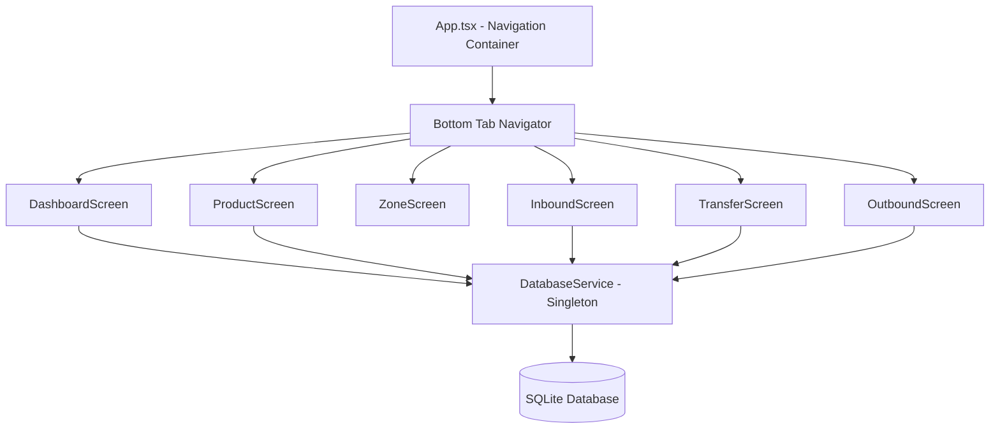

# เอกสารการออกแบบ (Technical Design Document)

## ภาพรวม (Overview)

ระบบ WMS เป็นแอป React Native (bare workflow) ที่มีสถาปัตยกรรมแบบง่าย: **Singleton Database Layer → Screens** ไม่มี state management library เพิ่มเติม (ไม่ใช้ Zustand/Redux สำหรับฟีเจอร์นี้) — แต่ละ Screen จะเรียก Database Layer โดยตรงและจัดการ state ด้วย `useState`/`useEffect`

### เป้าหมาย
- แอป CRUD ตรงไปตรงมา: จัดการสินค้า, รับเข้า, โอนย้าย, เบิกจ่าย
- SQLite เป็น single source of truth
- ไม่มี network layer, ไม่มี authentication — ทำงานแบบ offline-only

## สถาปัตยกรรม (Architecture)



### โครงสร้างโฟลเดอร์

```
src/
├── db/
│   └── DatabaseService.ts      # Singleton class จัดการ SQLite ทั้งหมด
├── screens/
│   ├── DashboardScreen.tsx
│   ├── ProductScreen.tsx
│   ├── ZoneScreen.tsx
│   ├── InboundScreen.tsx
│   ├── TransferScreen.tsx
│   └── OutboundScreen.tsx
├── types/
│   └── index.ts                # TypeScript interfaces
├── constants/
│   └── zones.ts                # Zone structure (hardcoded)
└── navigation/
    └── AppNavigator.tsx         # Bottom Tab setup
```

### การตัดสินใจทางเทคนิค

| หัวข้อ | การตัดสินใจ | เหตุผล |
|--------|------------|--------|
| State Management | useState/useEffect ใน Screen | แอปเล็ก, ไม่ต้องการ global state |
| Database Access | Singleton Pattern | ป้องกันการเปิด connection ซ้ำซ้อน |
| Zone Structure | Hardcoded constant | โซนไม่เปลี่ยนแปลง, ไม่ต้องเก็บใน DB |
| Navigation | Bottom Tab (Phone) / Side (Tablet) | ตาม requirement, ใช้ Dimensions API ตรวจจับ |
| UI Library | react-native-paper | Material Design components พร้อมใช้ |

## ส่วนประกอบและอินเตอร์เฟซ (Components and Interfaces)

### DatabaseService (Singleton)

```typescript
class DatabaseService {
  private static instance: DatabaseService;
  private db: SQLiteDatabase;

  static getInstance(): DatabaseService;
  
  // Init
  initialize(): Promise<void>;
  
  // Products CRUD
  getAllProducts(): Promise<Product[]>;
  addProduct(p: Omit<Product, 'id'>): Promise<number>;
  updateProduct(p: Product): Promise<void>;
  deleteProduct(id: number): Promise<void>;
  
  // Stock
  getStockByZone(zone: string): Promise<StockEntry[]>;
  getStockByProduct(productId: number): Promise<StockEntry[]>;
  getTotalStockByProduct(productId: number): Promise<number>;
  
  // Transactions
  inbound(productId: number, toZone: string, qty: number): Promise<void>;
  transfer(productId: number, fromZone: string, toZone: string, qty: number): Promise<void>;
  outbound(productId: number, fromZone: string, qty: number): Promise<void>;
  
  // Dashboard
  getDashboardSummary(): Promise<DashboardData>;
  getLowStockProducts(): Promise<Product[]>;
  getRecentLogs(limit: number): Promise<TransactionLog[]>;
}
```

### Screen Components

แต่ละ Screen เป็น functional component ที่:
1. เรียก `DatabaseService.getInstance()` 
2. โหลดข้อมูลใน `useEffect`
3. ใช้ `useState` สำหรับ local state (form data, modal visibility)
4. เรียก DB method เมื่อ user ทำ action → refresh state


## โมเดลข้อมูล (Data Models)

### SQL Schema

```sql
CREATE TABLE IF NOT EXISTS products (
  id INTEGER PRIMARY KEY AUTOINCREMENT,
  name TEXT NOT NULL,
  unit TEXT NOT NULL,
  category TEXT NOT NULL CHECK(category IN ('ไฟฟ้า', 'Accessory', 'อิเล็กทรอนิกส์', 'พลาสติก')),
  description TEXT DEFAULT '',
  reorderPoint INTEGER NOT NULL DEFAULT 0
);

CREATE TABLE IF NOT EXISTS stock (
  productId INTEGER NOT NULL,
  zone TEXT NOT NULL,
  quantity INTEGER NOT NULL DEFAULT 0 CHECK(quantity >= 0),
  PRIMARY KEY (productId, zone),
  FOREIGN KEY (productId) REFERENCES products(id) ON DELETE CASCADE
);

CREATE TABLE IF NOT EXISTS logs (
  id INTEGER PRIMARY KEY AUTOINCREMENT,
  type TEXT NOT NULL CHECK(type IN ('inbound', 'outbound', 'transfer')),
  productId INTEGER NOT NULL,
  fromZone TEXT,
  toZone TEXT,
  quantity INTEGER NOT NULL,
  timestamp TEXT NOT NULL,
  FOREIGN KEY (productId) REFERENCES products(id)
);
```

### TypeScript Interfaces

```typescript
// types/index.ts

export interface Product {
  id: number;
  name: string;
  unit: string;
  category: 'ไฟฟ้า' | 'Accessory' | 'อิเล็กทรอนิกส์' | 'พลาสติก';
  description: string;
  reorderPoint: number;
}

export interface StockEntry {
  productId: number;
  zone: string;
  quantity: number;
}

export interface TransactionLog {
  id: number;
  type: 'inbound' | 'outbound' | 'transfer';
  productId: number;
  fromZone: string | null;
  toZone: string | null;
  quantity: number;
  timestamp: string; // ISO 8601
}

export interface DashboardData {
  totalStock: number;
  zoneAStock: number;
  zoneBStock: number;
  zoneCStock: number;
  totalProducts: number;
  totalTransactions: number;
}
```

### Zone Constants

```typescript
// constants/zones.ts

export const ZONES = {
  A: ['A1', 'A2', 'A3'],
  B: ['B1', 'B2', 'B3'],
  C: ['C1', 'C2', 'C3'],
} as const;

export const ALL_SUB_ZONES = [...ZONES.A, ...ZONES.B, ...ZONES.C];

export const getMainZone = (subZone: string): string => subZone[0]; // 'A1' → 'A'
```

### Key Algorithms

**1. คำนวณสต็อกรวมตามโซนหลัก (Dashboard)**

```typescript
// SELECT SUM(quantity) FROM stock WHERE zone LIKE 'A%'
getZoneStock(mainZone: string): Promise<number> {
  return this.db.executeSql(
    `SELECT COALESCE(SUM(quantity), 0) as total FROM stock WHERE zone LIKE ?`,
    [`${mainZone}%`]
  );
}
```

**2. ตรวจสอบ Reorder Point**

```typescript
getLowStockProducts(): Promise<Product[]> {
  return this.db.executeSql(`
    SELECT p.* FROM products p
    WHERE (SELECT COALESCE(SUM(s.quantity), 0) FROM stock s WHERE s.productId = p.id) < p.reorderPoint
  `);
}
```

**3. Transfer (Atomic Operation)**

```typescript
async transfer(productId: number, fromZone: string, toZone: string, qty: number): Promise<void> {
  // ตรวจสอบก่อน
  const currentStock = await this.getStockQuantity(productId, fromZone);
  if (qty > currentStock) throw new Error('จำนวนเกินสต็อกที่มี');
  if (fromZone === toZone) throw new Error('โซนต้นทางและปลายทางต้องไม่ซ้ำกัน');
  
  // ดำเนินการ (ใช้ transaction เพื่อ atomicity)
  await this.db.transaction(async (tx) => {
    tx.executeSql(`UPDATE stock SET quantity = quantity - ? WHERE productId = ? AND zone = ?`, [qty, productId, fromZone]);
    tx.executeSql(`INSERT OR REPLACE INTO stock (productId, zone, quantity) VALUES (?, ?, COALESCE((SELECT quantity FROM stock WHERE productId = ? AND zone = ?), 0) + ?)`, [productId, toZone, productId, toZone, qty]);
    tx.executeSql(`INSERT INTO logs (type, productId, fromZone, toZone, quantity, timestamp) VALUES ('transfer', ?, ?, ?, ?, ?)`, [productId, fromZone, toZone, qty, new Date().toISOString()]);
  });
}
```


## คุณสมบัติความถูกต้อง (Correctness Properties)

*Property คือคุณลักษณะหรือพฤติกรรมที่ต้องเป็นจริงเสมอในทุกการทำงานที่ถูกต้องของระบบ — เป็นข้อกำหนดเชิงรูปนัยว่าระบบควรทำอะไร Properties เป็นสะพานเชื่อมระหว่าง specification ที่มนุษย์อ่านได้ กับการตรวจสอบความถูกต้องที่เครื่องทำได้*

### Property 1: Product Round-Trip (การจัดเก็บและเรียกคืนข้อมูลสินค้า)

*For any* valid Product object, storing it to the database and then retrieving it by id should produce an object with identical field values (name, unit, category, description, reorderPoint)

**Validates: Requirements 2.1**

### Property 2: Transfer Total Stock Invariant (ผลรวมสต็อกคงที่หลังโอนย้าย)

*For any* product, the sum of all stock entries across all zones before a transfer must equal the sum after the transfer completes

**Validates: Requirements 13.1, 9.3**

### Property 3: Inbound Increases Stock (รับเข้าเพิ่มสต็อกถูกต้อง)

*For any* product, zone, and positive quantity, performing an inbound operation should increase the stock of that product in that zone by exactly the specified quantity

**Validates: Requirements 8.2, 8.3**

### Property 4: Outbound Decreases Stock (เบิกจ่ายลดสต็อกถูกต้อง)

*For any* product, zone, and quantity where quantity ≤ current stock, performing an outbound operation should decrease the stock of that product in that zone by exactly the specified quantity

**Validates: Requirements 10.3, 10.4**

### Property 5: Cascade Delete (ลบสินค้าลบสต็อกทั้งหมด)

*For any* product that is deleted, there should be zero StockEntry records remaining in the database that reference that product's id

**Validates: Requirements 6.6, 13.2**

### Property 6: Non-Negative Stock Invariant (สต็อกไม่ติดลบ)

*For any* StockEntry in the database, the quantity field must always be ≥ 0, regardless of what sequence of operations has been performed

**Validates: Requirements 13.3**

### Property 7: Low Stock Detection (ตรวจจับสต็อกต่ำ)

*For any* product where the total stock across all zones is less than its reorderPoint, that product must appear in the low-stock alert list; conversely, products with total stock ≥ reorderPoint must not appear

**Validates: Requirements 5.4**

### Property 8: Zone Stock Aggregation (ผลรวมสต็อกตามโซน)

*For any* main zone (A, B, C), the reported zone total must equal the sum of quantities from all sub-zones belonging to that main zone (e.g., Zone A total = stock in A1 + A2 + A3)

**Validates: Requirements 5.1, 7.2, 7.3**

### Property 9: Product Filter by Zone (แสดงเฉพาะสินค้าที่มีสต็อก)

*For any* zone, the list of available products for that zone must contain exactly those products that have a StockEntry with quantity > 0 in that zone

**Validates: Requirements 9.2, 10.2**

### Property 10: Valid Timestamps (timestamp ถูกต้อง)

*For any* TransactionLog entry in the database, the timestamp field must be a valid ISO 8601 date string

**Validates: Requirements 13.4**


## การจัดการข้อผิดพลาด (Error Handling)

### กลยุทธ์หลัก

| สถานการณ์ | การจัดการ |
|-----------|----------|
| จำนวน ≤ 0 | แสดง error message, ไม่ดำเนินการ |
| จำนวนเกินสต็อก (outbound/transfer) | แสดง error message, ไม่ดำเนินการ |
| โซนต้นทาง = ปลายทาง (transfer) | แสดง error message, ไม่ดำเนินการ |
| ฟอร์มไม่ครบ (product) | แสดง error message ระบุฟิลด์ที่ขาด |
| Database error | try-catch → แสดง Toast error, log to console |

### Validation Layer

Validation จะทำที่ DatabaseService level (ก่อน execute SQL):

```typescript
// ตัวอย่าง validation ใน DatabaseService
async outbound(productId: number, fromZone: string, qty: number): Promise<void> {
  if (qty <= 0) throw new Error('จำนวนต้องมากกว่า 0');
  
  const current = await this.getStockQuantity(productId, fromZone);
  if (qty > current) throw new Error('จำนวนเกินสต็อกที่มี');
  
  await this.db.transaction(async (tx) => {
    tx.executeSql(`UPDATE stock SET quantity = quantity - ? WHERE productId = ? AND zone = ?`, [qty, productId, fromZone]);
    tx.executeSql(`INSERT INTO logs (type, productId, fromZone, toZone, quantity, timestamp) VALUES ('outbound', ?, ?, NULL, ?, ?)`, [productId, fromZone, qty, new Date().toISOString()]);
  });
}
```

### Screen Level Error Handling

```typescript
// Pattern สำหรับทุก Screen
const handleSubmit = async () => {
  try {
    await DatabaseService.getInstance().inbound(productId, zone, qty);
    Toast.show({ type: 'success', text1: 'รับสินค้าเข้าสำเร็จ' });
    refreshData();
  } catch (error: any) {
    Toast.show({ type: 'error', text1: error.message });
  }
};
```

## กลยุทธ์การทดสอบ (Testing Strategy)

### ภาพรวม

ใช้ **Jest** สำหรับ unit testing โดยเน้นทดสอบ logic ของ DatabaseService (business layer) ไม่ test UI rendering

### Unit Tests

ทดสอบ specific examples และ edge cases:

- **DatabaseService initialization**: ตรวจสอบว่าตารางถูกสร้าง
- **Product CRUD**: เพิ่ม/แก้ไข/ลบสินค้า
- **Validation**: ปฏิเสธข้อมูลไม่ถูกต้อง (qty ≤ 0, ฟอร์มไม่ครบ)
- **Edge cases**: ลบสินค้าที่มี stock, transfer เกิน stock

### Property-Based Tests

ใช้ **fast-check** (มีอยู่แล้วใน package.json) สำหรับ property-based testing:

- ทุก property test ต้องรัน minimum **100 iterations**
- ทุก test ต้อง tag ด้วย comment อ้างอิง property จาก design document
- แต่ละ correctness property → 1 property-based test

**ตัวอย่าง tag format:**
```typescript
// Feature: warehouse-management-system, Property 2: Transfer Total Stock Invariant
it('total stock should remain unchanged after transfer', () => {
  fc.assert(fc.property(
    fc.integer({ min: 1, max: 100 }),
    fc.constantFrom(...ALL_SUB_ZONES),
    fc.constantFrom(...ALL_SUB_ZONES),
    (qty, fromZone, toZone) => {
      // ... test logic
    }
  ), { numRuns: 100 });
});
```

### โครงสร้างไฟล์ทดสอบ

```
__tests__/
├── db/
│   ├── DatabaseService.test.ts       # Unit tests
│   └── DatabaseService.property.ts   # Property-based tests (fast-check)
└── constants/
    └── zones.test.ts                 # Zone structure verification
```

### Mock Strategy

- ใช้ **in-memory SQLite** หรือ mock `react-native-sqlite-storage` สำหรับ test
- ไม่ต้อง mock network (ไม่มี network calls)
- แต่ละ test case เริ่มจาก fresh database

### Test Coverage เป้าหมาย

| Layer | เป้าหมาย |
|-------|----------|
| DatabaseService (logic) | 90%+ |
| Constants/Types | 100% |
| Screens (UI) | ไม่ test ใน phase นี้ |
